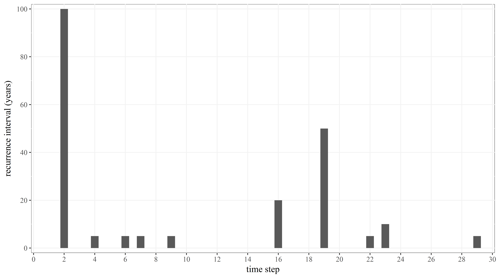

# Coupled_ABM-Flood_Model
This coupled ABM-Flood model is based on the modelling framework called Coupled fLood-Agent-Institution Modelling framework (CLAIM). CLAIM integrates actors, institutions, the urban environment, hydrologic and hydrodynamic processes and external factors that affect local flood risk management (FRM) activities. The framework conceptualizes the complex interaction of floods, humans and their environment as drivers of flood hazard, vulnerability and exposure. A full description of the CLAIM framework can be found in Abebe et al. (2019). 

The human subsystem is modelled using the agent-based modelling approach (ABM). As such, it incorporates heterogeneous actors and their actions on and interactions with their environment and flood. It also provides the possibility to analyze the underlying institutions that govern the actions and interactions in managing flood risk by incorporating MAIA (Modelling Agent systems using Institutional Analysis) meta-model (Ghorbani et al., 2013). The flood subsystem is modelled using physically-based, numerical flood modelling software. Then, the ABM is coupled with the flood model dynamically to understand how humans and their environment interact, to experiment the effect of different institutions and to investigate FRM policy options.

The code is structured based on MAIA, and it is developed in the Repast Simphony (RS) development environment (https://repast.github.io/). The model is developed for the FRM case of the Caribbean Island of Sint Maarten. Unfortunately, some datasets used for the ABM and the coupled flood model (developed in the commercial MIKE FLOOD software - https://www.mikepoweredbydhi.com/download/mike-2017) are not provided because of restricted access. However, since the coupling is done within the ABM code, one can get a good idea of how ABMs can be coupled with domain models, how to handle data exchange between the two and how institutions are structured and incorporated in ABMs.

The code has five packages:
1.	Collective structure
2.	Operational structure
3.	Physical structure
4.	Main data collection
5.	Context builder (StMaarten)

The first three packages are based on the MAIA structure – the collective and physical structures create the agent and object classes while the operational structure stores three action situation classes. These classes define the most important human and flood dynamics. The other two packages are based on the RS architecture. The StMaarten builder package implements model initialization and the MainDataCollection package implements result collection and creating csv outputs.

This work is licensed under the Creative Commons Attribution-NonCommercial-ShareAlike 4.0 International License (https://creativecommons.org/licenses/by-nc-sa/4.0/).

Below, a full description of the **ODD protocol** (Grimm et al., 2006) is provided.
## 1.	Overview
#### Purpose
The purpose of the coupled model is to analyse the implications of three institutions, which are beach policy (BP), building ordinance (BO) and flood zoning policy (FZ), in the Caribbean island of Sint Maarten and evaluate how different agents’ responses to these policies influence the overall flood risk. The BP restricts the construction of buildings within 50m of the Sint Maarten coastline. The BO obliges buildings must elevate their floor height by 0.2m. The FZ is part of a draft National Development Plan and it obliges buildings must elevate their floor height by 0.5m, 1m or 1.5m depending on the location of the building. The model is also used to analyse the effect of implementing flood hazard reduction measures, improving drainage networks and building dikes.

#### State variables and Scales
The two agents considered in this case are household agents and government agent. Household agents have houses and plans and in the ABM environment, the agents are represented by the houses they live in. We assume that there are only residential houses; a household owns only one house; and the agents have a static location. Houses are characterized by location, elevation and floor height. Corresponding to the policies, the agents have attributes that reflect their behaviour – BP compliance, BO compliance and FZ compliance (see the *Household.java* under the *collectiveStructure* package and the *House.java* under the *physicalStructure* package). The government agent is characterized by a level of policy enforcement. This agent does not have a physical representation. The policy enforcement is reflected by the BP, BO and FZ compliance thresholds.

A simulation runs for 30 years in which one time step represents one year. The environment is represented by a raster file of 30m x 30m resolution. To reduce computation time, this file is not loaded directly to the ABM, but it is used in the flood model. Household locations, elevations and flood depths are spatially represented in the model explicitly.

#### Process overview and Scheduling
There are three processes in the coupled model: urban development and vulnerability/exposure considerations, ABM-flood model coupling, and flood hazard reduction. A full process flowchart is illustrated in Figure 1.

i.	Urban development and vulnerability/exposure considerations: the following sub-processes happen in order in each time step – urban building expansion, making plan, implementing BP (Figure 1b), implementing FZ (Figure 1c), implementing BO (Figure 1d) and building houses (see *UrbanDevelopmentActionSituation.java* under the *operationalStructure* package). If a household follows the FZ and elevate the house, the sub-process ‘implementing BO’ does not run as the house would already be elevated.

ii.	ABM-flood model coupling: the following sub-processes run in order – compute catchments curve number (based on new developments) and update flood model rainfall-runoff file, call and run the flood model, geoprocess flood model result (i.e., flood map), assess impact (check if houses are flooded) and update household agents’ attribute (see *ABMFloodModelcouple.java* under the *operationalStructure* package).  All the sub-processes run if there is flood-causing rainfall in a given time step.

iii.	Flood hazard reduction: the following sub-processes run in order – select catchment where flood hazard reduction measure is implemented (Figure 1e), update flood model hydraulic input files (see *ABMFloodModelcouple.java* under the *operationalStructure* package). All the sub-processes run if there is flood causing rainfall in a given time step.

Figure 1. Coupled ABM-flood model implementation flowchart for the Sint Maarten flood risk management. (a) shows the general flow chart while (b), (c) and (d) show how the BP, FZ and BO policies are implemented, respectively. (e) shows the criteria to select catchments where structural measures are implemented. In the figure, CN is curve number; RR is rainfall-runoff; CR is compliance rate, RI is recurrence interval, tick is the ABM time step,  is the years between the implementation of consecutive measures,  is the BP distance from the sea, , , and  are the compliance thresholds for BP, FZ and BO, respectively, and  and  are the catchment and minimum (threshold) number of flooded houses, respectively.

## 2.	Design Concepts
**Emergence** – Flood risk levels (including number of flooded houses, how many of the flooded houses elevated their house or built far from the coastline) emerge from the behaviour of household agents, their decision to follow (or not) policies that reduce their vulnerability and exposure, and from the behaviours of the government agent, its decision to implement (or not) measures that reduce the flood hazard. The behaviours of the government and household agents are represented by parameters based on threshold limits. Thus, adaptation is not modelled explicitly.

**Sensing** – Household agents are assumed to know about the policies, their elevation and their location. The government agent is assumed to know the type of measures they implement and where/when to implement the measures. This agent is also assumed to know the number of flooded houses after a flood event. 

**Interaction** – Households agents interact with the government agent indirectly through the thresholds defined to determine whether household agents follow an institution or not. The thresholds implicitly show the level of enforcement of the institutions the government agent employs on the household agents.

**Stochasticity** – Although thresholds are predefined (as scenario input variables), agents’ institution compliance rates are stochastic (drawn from random uniform distribution). Locations of new houses are also stochastic. 

**Observation** – The output of the mode is the level of flood risk, i.e., levels of exposure measured by the number of houses built outside the delineated beach zone, levels of physical vulnerability measured by the number of houses elevated, levels of hazard measured by the depth and extent of floods (especially before and after the implementation of a flood reduction measure) and the impact measured by the total number of flooded houses. All output data are collected at the end of each time step (see the *mainDataCollection* package). Agent related outputs are collected in a CSV file while flood maps are saved in a raster tiff format. 

## 3.	Details
#### Initialization
The coupled ABM-flood model simulation is initialized by loading features from shapefiles. Some of the feature data are used in the simulation analysis (i.e., polygon features - hydrological catchment/sub-catchments and floodprone area; point features – existing and future development/building locations; and polyline feature – coastline) while others are loaded for only visualization purpose (i.e., polygon features – coastline and waterbodies). The curve numbers of the sub-catchments are also loaded in the initialization. The existing household agents are initiated based on the existing building point feature data (the default number of agents is 12000) and 80% of these houses are initially elevated. The elevated houses are assigned randomly. (See *StMaartenBuilder.java* under the *stMaarten* package). Although the flood model is not initialized together with the ABM model, a calibrated (based on the existing condition) flood model should be developed before running the coupled model simulation. 

#### Input
In addition to the shapefiles mentioned above, an event series of rainfall is defined. We assume that there is a maximum of one flood event in a given time step. In this case, we generate a hypothetical design rainfall event series (see *Flood.java* under the *physicalstructure* package). As shown in Figure 2, at each time step, if there is a flood-generating rainfall event (we assume that in Sint Maarten only rainfall events with a recurrence interval of 5 years and above cause flooding), the design rainfall of the event is specified. However, the time series of the rainfall event, which includes the duration and intensity of the rainfall, is defined in the flood model. For the flood model, a raster topography/bathymetry data, drainage network and cross-section data, boundary data and hydrodynamic data are required.

Figure 2. Input design rainfall events. It shows discrete recurrence intervals in years assuming that there is a maximum of one major flood event per time step.

#### Submodels
**Urban housing expansion**: In this model, the housing expansion mechanism is simplified in which the number and locations of new houses are based on the building permits issued by VROMI (Ministry of Public Housing, Spatial Planning, Environment and Infrastructure of the Government of Sint Maarten) and on the National Development Plan (NDP). A map provided with the NDP delineates residential areas showing existing and future housing parcels. We extracted the future housing locations and these locations are available for new household agents to randomly choose. 

**Implementing BP, FZ and BO**: Agents may not behave in the same way for all institutions (e.g., an agent may build an elevated house but only 20m from the coastline). Hence, each household agent has three parameters that correspond to the compliance of the three institutions (i.e., BP, BO and FZ compliance rates). These compliance rates are drawn from a uniform random distribution for each new household agent. For the institutions, threshold compliance values (i.e., BP, BO and FZ compliances thresholds) are set at the beginning of the simulation and are kept constant throughout.

In terms of implementation, all the three policies are implemented in the same way. The policy compliance thresholds implicitly reflect the level of policy enforcement by the government agent. Household agents comply with the institutions if their compliance variable is less than or equal to the institution compliance threshold. For example, a household agent has a BO compliance rate value between 0 and 1. If the BO compliance threshold is 1, the household agent will comply with the BO since its compliance rate is less than the BO compliance threshold. That means, the agent elevates its house floor by 0.2m. On the other hand, if the BO compliance threshold is 0, the household agent will not follow the BO because its compliance rate has a value greater than the BO compliance threshold. In that case, the agent does not elevate its house floor.

**Implementing flood hazard reduction measure**: In Sint Maarten, most flood hazard reduction measures are implemented in a reactive manner. As a result, this submodel runs only if there is a flood event. The catchment where a measure is implemented is selected based on the highest number of flooded houses in the previous time step. However, that criteria will not be checked unless there is a rainfall with a recurrence interval of 50yr or above in a given time step or the last measure was implemented at least 3 years (time steps) before the current time step. A threshold of 3 years interval is inserted considering the availability of budget and the average number of years it takes to construct a flood hazard reduction measure.

### References

Abebe, Y.A., Ghorbani, A., Nikolic, I., Vojinovic, Z., Sanchez, A., 2019. A coupled flood-agent-institution modelling (CLAIM) framework for urban flood risk management. Environ. Model. Softw. 111, 483–492. https://doi.org/10.1016/j.envsoft.2018.10.015

Ghorbani, A., Bots, P., Dignum, V., Dijkema, G., 2013. MAIA: a Framework for Developing Agent-Based Social Simulations. JASSS 16, 9. https://doi.org/10.18564/jasss.2166

Grimm, V., Berger, U., Bastiansen, F., Eliassen, S., Ginot, V., Giske, J., Goss-Custard, J., Grand, T., Heinz, S.K., Huse, G., Huth, A., Jepsen, J.U., Jørgensen, C., Mooij, W.M., Müller, B., Pe’er, G., Piou, C., Railsback, S.F., Robbins, A.M., Robbins, M.M., Rossmanith, E., Rüger, N., Strand, E., Souissi, S., Stillman, R.A., Vabø, R., Visser, U., DeAngelis, D.L., 2006. A standard protocol for describing individual-based and agent-based models. Ecological Modelling 198, 115–126. https://doi.org/10.1016/j.ecolmodel.2006.04.023

